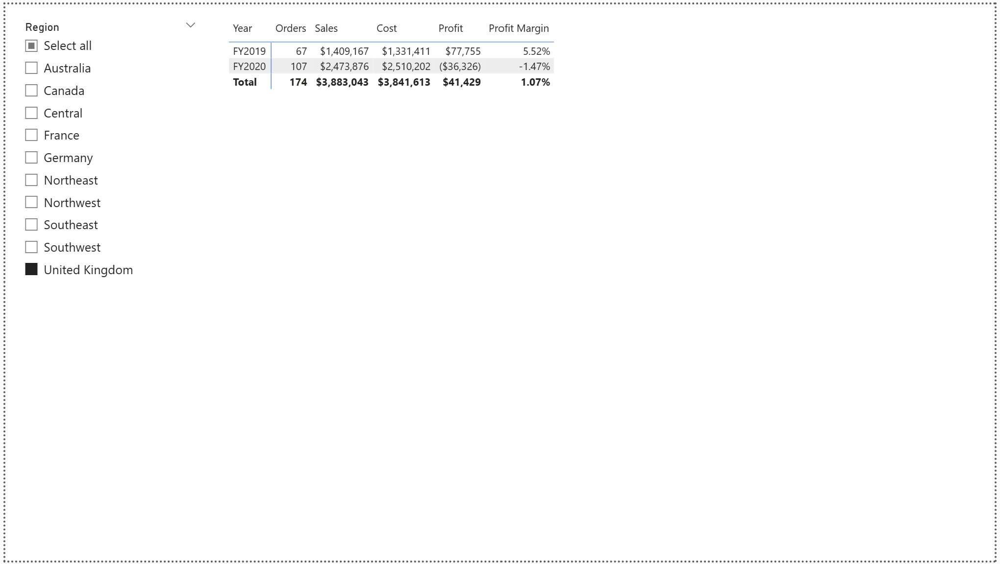

# PL-300 Power BI Project – Sales Analysis & Dashboards

This repository showcases my work from the **PL-300: Microsoft Power BI Data Analyst** course labs.  
It includes my Power BI reports, dashboards, datasets, and screenshots, covering my progress from Lab 1 through Lab 12.

The project demonstrates my ability to clean data, model data, create visuals, write DAX measures, and design interactive Power BI reports and dashboards.

---

## Repository Contents

### **1. Power BI Labs (PBIX Files)**
The following lab reports are included:

- **Lab 3 – Data Modelling Basics**  
- **Lab 4 – Create DAX Calculations**  
- **Lab 5 – Time Intelligence & Advanced DAX**  
- **Lab 6 – Build Report Visuals & Layout**  
- **Lab 7 – Apply Filters & Interactions**  
- **Lab 8 – Enhance Report for Usability**  
- **Lab 9 – Create Final Multi-Page Report**  
- **Lab 12 – Create Power BI Dashboard & Workspace Management**

Each lab has a **live interactive link** available in my Power BI workspace.

---

## **Live Power BI Links**

- **Lab 3 Live Link** → https://app.powerbi.com/view?r=eyJrIjoiYTQwMGYyOTEtYmYyNi00Nzk0LWFkNGQtM2VhYjg3MWFiMDJjIiwidCI6IjNlYTdjMTI4LWM2MDEtNDQ3OS1hMDAzLWUxNGQwMGMwYjVjYiJ9
- **Lab 4 Live Link** → https://app.powerbi.com/view?r=eyJrIjoiYjA5NmNhOTYtYjVhOC00N2VlLWIyMzYtNDNlMmM3OWQ5YjcyIiwidCI6IjNlYTdjMTI4LWM2MDEtNDQ3OS1hMDAzLWUxNGQwMGMwYjVjYiJ9 
- **Lab 5 Live Link** → https://app.powerbi.com/view?r=eyJrIjoiMmI3ODc4MTAtNDgyNC00YTU0LWJkNTAtMWU3Y2M2ZjViNWY3IiwidCI6IjNlYTdjMTI4LWM2MDEtNDQ3OS1hMDAzLWUxNGQwMGMwYjVjYiJ9
- **Lab 6 Live Link** → https://app.fabric.microsoft.com/view?r=eyJrIjoiMzNkNjNhYzctMThiNS00MDI3LTg0ZjUtYmNmYjNiMTljZWIzIiwidCI6IjNlYTdjMTI4LWM2MDEtNDQ3OS1hMDAzLWUxNGQwMGMwYjVjYiJ9 
- **Lab 7 Live Link** → https://app.fabric.microsoft.com/reportEmbed?reportId=ab241120-3e51-4b2d-b30c-b91282a35d53&autoAuth=true&ctid=3ea7c128-c601-4479-a003-e14d00c0b5cb 
- **Lab 8 Live Link** → https://app.powerbi.com/view?r=eyJrIjoiMDczZDZjMzQtOWRkMS00NDgzLWE3MTktYjBkNjQxMjIxZWZmIiwidCI6IjNlYTdjMTI4LWM2MDEtNDQ3OS1hMDAzLWUxNGQwMGMwYjVjYiJ9
- **Lab 9 Live Link** → https://app.powerbi.com/view?r=eyJrIjoiMDczZDZjMzQtOWRkMS00NDgzLWE3MTktYjBkNjQxMjIxZWZmIiwidCI6IjNlYTdjMTI4LWM2MDEtNDQ3OS1hMDAzLWUxNGQwMGMwYjVjYiJ9
- **Lab 12 Live Link** → https://app.powerbi.com/view?r=eyJrIjoiNTM0YWJmYzUtNGUxZi00NGQ4LTkxMjktNDVhYzFmNDFlMDBiIiwidCI6IjNlYTdjMTI4LWM2MDEtNDQ3OS1hMDAzLWUxNGQwMGMwYjVjYiJ9

---

## **Screenshots – Key Report Pages**

### **Lab 12 Final Project – Dashboard & Report Views**

| My Performance Page | Profit Page |
|---------------------|-------------|
|  |  |

| Sales Monitoring Dashboard | Sales Report |
|----------------------------|--------------|
|  |  |

| Product Details |
|-----------------|
|  |

---

## Skills Demonstrated

### **Power BI Desktop**
- Data import and transformation (Power Query)
- Creating calculated columns
- Designing report pages for readability & usability
- Adding tooltips, drill-through, and custom interactions
- Building dashboards from visual report elements

### **Data Modeling**
- Creating table relationships  
- Using star schema structure  
- Understanding cardinality and cross-filter direction  

### **DAX (Data Analysis Expressions)**
- Basic measures: SUM, AVERAGE, COUNTROWS, DISTINCTCOUNT  
- Conditional logic (IF, SWITCH)  
- Time intelligence: YTD, previous period comparison  
- CALCULATE and filters  
- KPI measures and performance metrics  

### **Visualization**
- Bar charts, column charts, line charts  
- KPI cards  
- Slicers for filtering  
- Matrix and table visuals  
- Buttons, bookmarks, navigation  
- Dashboard pinning (Lab 12)

---

## Data Source

The dataset used for all labs: `PL300-Skillable Key.xlsx`

Included in this repository.

---

## Note About Lab Files

These labs were completed in the PL-300 training environment using a virtual machine, so not all lab files are available in this repository.

Labs included here:  
**3, 4, 5, 6, 7, 8, 9, and 12**

---

## How to View the PBIX Files

GitHub cannot preview `.pbix` files.  
You must download and open them in **Power BI Desktop**:

---

## Project Summary

This project highlights my end-to-end Power BI skills:

- Cleaning & transforming data  
- Developing a data model  
- Writing DAX measures  
- Creating multi-page interactive reports  
- Designing dashboards in Power BI Service  
- Managing workspaces and sharing content  

It is a complete demonstration of the learning outcomes from PL-300.

---

# PowerBI_Project
Skills Learned (Short Version)  Importing and transforming data (Power Query)  Building data models &amp; relationships  Creating DAX measures (including time intelligence)  Designing reports and visuals  Adding interactivity (tooltips, drill-through, bookmarks)  Applying Row-Level Security  Publishing reports and creating dashboards

**[Open the report in Microsoft Fabric](https://app.fabric.microsoft.com/links/JUmECzyKys?ctid=3ea7c128-c601-4479-a003-e14d00c0b5cb&pbi_source=linkShare
)**

<iframe title="07-Starter-Sales Analysis" width="600" height="373.5" src="https://app.fabric.microsoft.com/view?r=eyJrIjoiN2JlYmY1NjAtZTNkNy00ZjY4LWI1NTMtOTlmOTdiZTkxMzM2IiwidCI6IjNlYTdjMTI4LWM2MDEtNDQ3OS1hMDAzLWUxNGQwMGMwYjVjYiJ9" frameborder="0" allowFullScreen="true"></iframe>
https://app.fabric.microsoft.com/links/JUmECzyKys?ctid=3ea7c128-c601-4479-a003-e14d00c0b5cb&pbi_source=linkShare

https://app.fabric.microsoft.com/links/JUmECzyKys?ctid=3ea7c128-c601-4479-a003-e14d00c0b5cb&pbi_source=linkShare

Lab12: 
https://app.powerbi.com/view?r=eyJrIjoiNTM0YWJmYzUtNGUxZi00NGQ4LTkxMjktNDVhYzFmNDFlMDBiIiwidCI6IjNlYTdjMTI4LWM2MDEtNDQ3OS1hMDAzLWUxNGQwMGMwYjVjYiJ9

Lab9:
https://app.powerbi.com/view?r=eyJrIjoiMDczZDZjMzQtOWRkMS00NDgzLWE3MTktYjBkNjQxMjIxZWZmIiwidCI6IjNlYTdjMTI4LWM2MDEtNDQ3OS1hMDAzLWUxNGQwMGMwYjVjYiJ9https://app.powerbi.com/view?r=eyJrIjoiMDczZDZjMzQtOWRkMS00NDgzLWE3MTktYjBkNjQxMjIxZWZmIiwidCI6IjNlYTdjMTI4LWM2MDEtNDQ3OS1hMDAzLWUxNGQwMGMwYjVjYiJ9

Lab8:
https://app.powerbi.com/view?r=eyJrIjoiN2JiMzY2N2UtMWM3Yy00YzdjLTljN2YtODk0MmFiMmVjOWJkIiwidCI6IjNlYTdjMTI4LWM2MDEtNDQ3OS1hMDAzLWUxNGQwMGMwYjVjYiJ9

Lab7:
https://app.powerbi.com/view?r=eyJrIjoiN2JlYmY1NjAtZTNkNy00ZjY4LWI1NTMtOTlmOTdiZTkxMzM2IiwidCI6IjNlYTdjMTI4LWM2MDEtNDQ3OS1hMDAzLWUxNGQwMGMwYjVjYiJ9

https://app.fabric.microsoft.com/reportEmbed?reportId=ab241120-3e51-4b2d-b30c-b91282a35d53&autoAuth=true&ctid=3ea7c128-c601-4479-a003-e14d00c0b5cb

Lab6:
https://app.fabric.microsoft.com/view?r=eyJrIjoiMzNkNjNhYzctMThiNS00MDI3LTg0ZjUtYmNmYjNiMTljZWIzIiwidCI6IjNlYTdjMTI4LWM2MDEtNDQ3OS1hMDAzLWUxNGQwMGMwYjVjYiJ9
